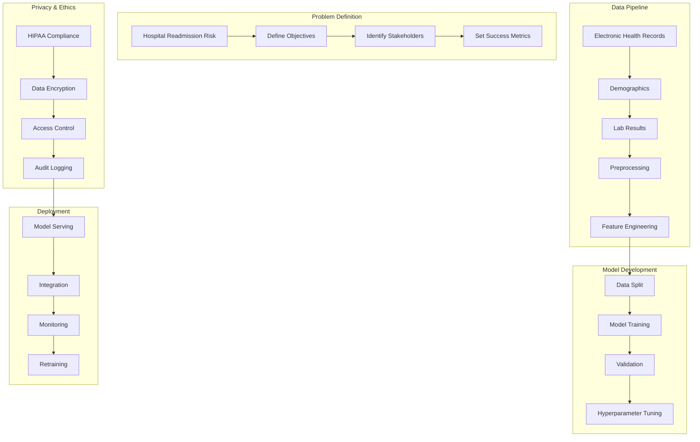

# AI Development Workflow Diagram

```mermaid
graph TD
    subgraph Problem Definition
        A[Hospital Readmission Risk] --> B[Define Objectives]
        B --> C[Identify Stakeholders]
        C --> D[Set Success Metrics]
    end

    subgraph Data Pipeline
        E[Electronic Health Records] --> F[Demographics]
        F --> G[Lab Results]
        G --> H[Preprocessing]
        H --> I[Feature Engineering]
    end

    subgraph Privacy & Ethics
        J[HIPAA Compliance] --> K[Data Encryption]
        K --> L[Access Control]
        L --> M[Audit Logging]
    end

    subgraph Model Development
        N[Data Split] --> O[Model Training]
        O --> P[Validation]
        P --> Q[Hyperparameter Tuning]
    end

    subgraph Deployment
        R[Model Serving] --> S[Integration]
        S --> T[Monitoring]
        T --> U[Retraining]
    end

    I --> N
    M --> R
``` 